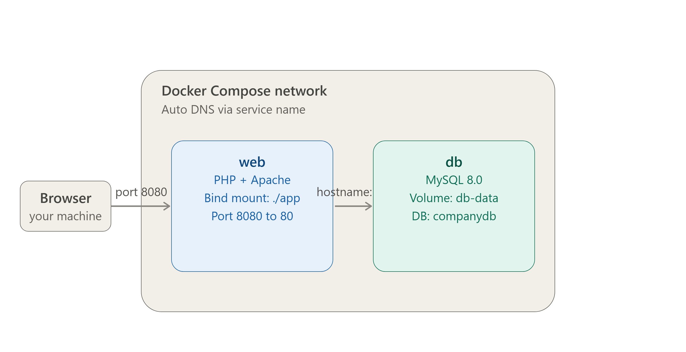
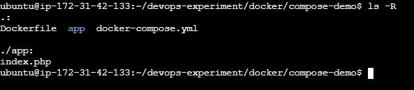
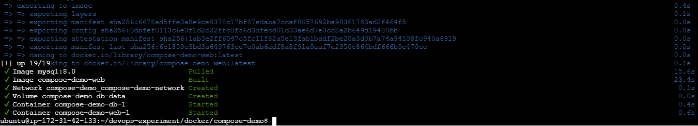
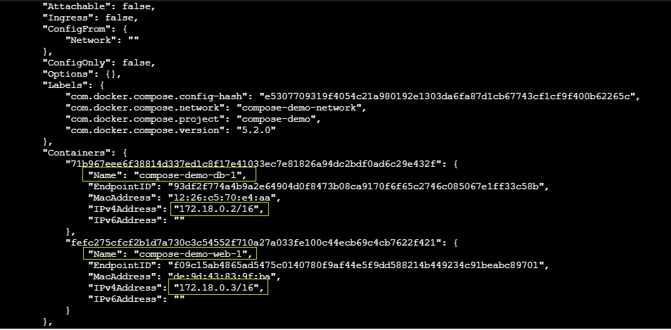
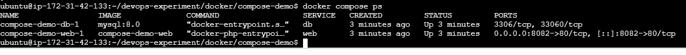
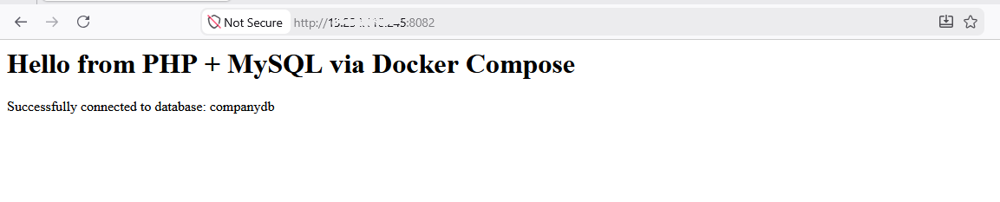
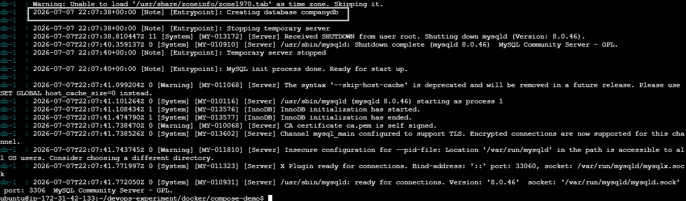
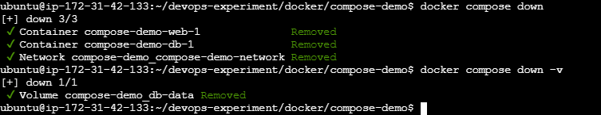

# PHP + MySQL Application Deployment with Docker Compose


## Project Overview

A startup's PHP website needed to connect to a MySQL database — without the team running multiple `docker run` commands by hand every time. This project packages the full stack (web + database) into a single Docker Compose file so the entire application starts, networks, and persists data with **one command**.

## Architecture Diagram



## Tech Stack

| Category         | Tool                      |
|-------------------|---------------------------|
| Web Runtime        | PHP 8 + Apache (official image) |
| Database           | MySQL (official image)    |
| Orchestration      | Docker Compose            |
| Networking         | Compose default bridge network |
| Persistence        | Named Docker volume       |


## Prerequisites
 
- Docker Engine installed and running
- Docker Compose v2 (`docker compose` CLI, bundled with Docker Desktop / Docker Engine 20.10+)
- Ports `8080` free on the host (used by the `web` service)
- Basic familiarity with the command line
Verify Docker Compose is available:
```bash
docker compose version
```
 
---

## Part 1 – Project Directory

Created the project folder and organized the application files separately from infrastructure files:

```bash
mkdir compose-demo && cd compose-demo
mkdir app
```

---

## Part 2 – The PHP Web Application

**Prerequisite: create a `.env` file**
 
Before writing the PHP file, create a `.env` file in the project root (`compose-demo/`) to hold the database credentials, so they aren't hardcoded in either the PHP file or `docker-compose.yml`:
 
```bash
touch .env
```
 
**.env**
```
DB_HOST=db
DB_USER=<mention user name>
DB_PASSWORD=<mention your password>
DB_NAME=companydb
```
 
Add `.env` to `.gitignore` so real credentials never get committed:
```
echo ".env" >> .gitignore
```
 
**app/index.php** — a simple page that connects to MySQL and confirms connectivity, reading credentials from environment variables:
 
```php
<?php
$host = getenv('DB_HOST');
$user = getenv('DB_USER');
$password = getenv('DB_PASSWORD');
$database = getenv('DB_NAME');
 
$conn = new mysqli($host, $user, $password, $database);
 
if ($conn->connect_error) {
    die("Connection failed: " . $conn->connect_error);
}
 
echo "<h1>Hello from PHP + MySQL via Docker Compose</h1>";
echo "<p>Successfully connected to database: " . $database . "</p>";
?>
```
---

## Part 3 – Dockerfile (Web Service)

```dockerfile
FROM php:8.2-apache

# Enable the MySQLi extension so PHP can talk to MySQL
RUN docker-php-ext-install mysqli

# Copy application files into the Apache web root
COPY app/ /var/www/html/

EXPOSE 80
```

---

## Part 4 – docker-compose.yml

```yaml
services:
  web:
    build: .
    ports:
      - "8080:80"
    volumes:
      - ./app:/var/www/html
    environment:
      DB_HOST: ${DB_HOST}
      DB_USER: ${DB_USER}
      DB_PASSWORD: ${DB_PASSWORD}
      DB_NAME: ${DB_NAME}
    depends_on:
      - db
    networks:
      - compose-demo-network
 
  db:
    image: mysql:8.0
    environment:
      MYSQL_ROOT_PASSWORD: ${DB_PASSWORD}
      MYSQL_DATABASE: ${DB_NAME}
    volumes:
      - db-data:/var/lib/mysql
    networks:
      - compose-demo-network
 
volumes:
  db-data:
 
networks:
  compose-demo-network:
    driver: bridge
```

- **If Port 8080 already in use:** change the host-side port mapping in `docker-compose.yml` (Here I have used `8082:80`).

> Directory structure
> 


**Key design choices:**
- `web` builds from the local `Dockerfile`; `db` uses the official MySQL image directly.
- Port `8080` on the host maps to `80` in the container, so the app is reachable at `http://public-ip:8080`.
- A bind mount (`./app:/var/www/html`) lets code changes reflect immediately without rebuilding.
- Verify the substituted values resolved correctly with `docker compose config` before starting
- `depends_on` ensures the database container starts before the web container attempts to connect.
- A named volume (`db-data`) persists MySQL data across container restarts.

---

## Part 5 – Deploy & Verify

**Single command to bring up the full stack:**
```bash
docker compose up -d --build
```

> Docker compose build completed.
> 

---

## Part 6 – Networking

Both services join the same Compose-managed bridge network (`compose-demo-network`), so the `web` container can reach the database simply by using the service name `db` as the hostname — no manual IP configuration or linking required.

```bash
docker network inspect compose-demo_compose-demo-network
```

**This shows both containers are attached to the same network with IPs in the same subnet.**
> 


**Terminal output of `docker compose ps` showing both containers `Up`.**
> 


**Browser screenshot of `http://public-ip:8080` showing the success message.**
> 


**Terminal output of `docker compose logs db` showing MySQL ready for connections.**
> 


**Verification checklist:**

| Check                                        | Command                               | Result |
|------------------------------------------------|----------------------------------------|--------|
| Both containers running                         | `docker compose ps`                    | ✅ Verified |
| Web app accessible in browser                   | `http://public-ip:8080`                | ✅ Verified |
| Database container healthy                      | `docker compose logs db`               | ✅ Verified |
| PHP successfully connects to MySQL              | Page displays "Successfully connected" | ✅ Verified |


**To tear down:**
```bash
docker compose down          # stop and remove containers
docker compose down -v       # also remove the persistent volume
```



---

## Troubleshooting Notes

- **PHP can't connect to MySQL on first startup:** MySQL can take a few seconds to initialize. If the app container starts too fast, add a retry loop in the PHP script or a healthcheck + `depends_on: condition: service_healthy` in Compose.
- **Port 8080 already in use:** change the host-side port mapping in `docker-compose.yml` (e.g. `8081:80`).
- **Changes to `index.php` not showing up:** confirm the bind mount path is correct and the browser isn't serving a cached page.

---

## Key Learnings

- Replacing multiple manual `docker run` commands with a single declarative Compose file.
- Using Compose's default network for automatic service discovery between containers.
- Combining bind mounts (for live code) with named volumes (for persistent data) in the same stack.
- Structuring a multi-service app so each container has a single, clear responsibility.

---

## Author

**Sinsha C**

[](https://github.com/sinsha-c)
[](https://linkedin.com/in/sinshac)

---
